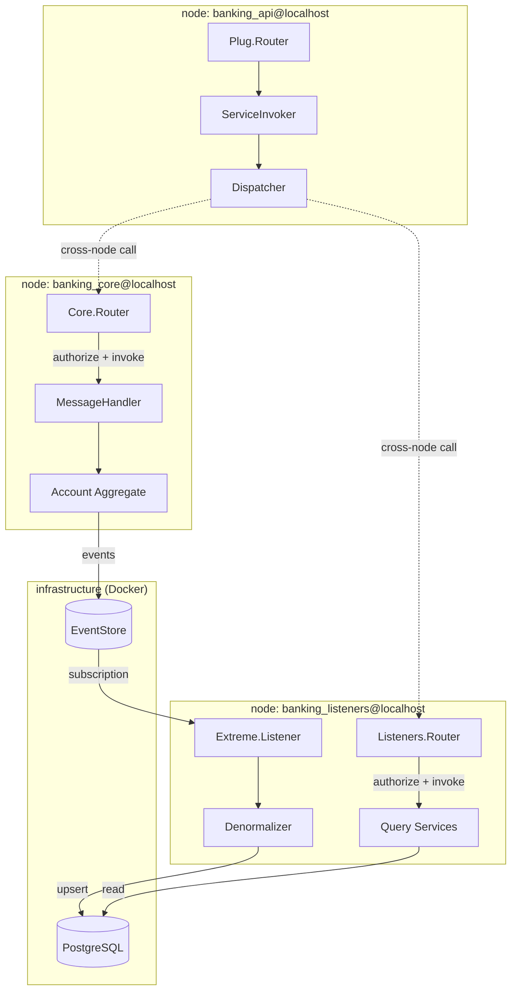
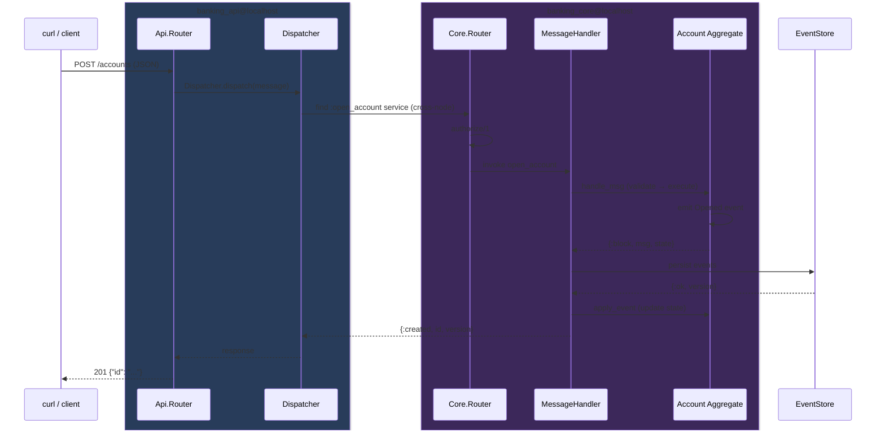
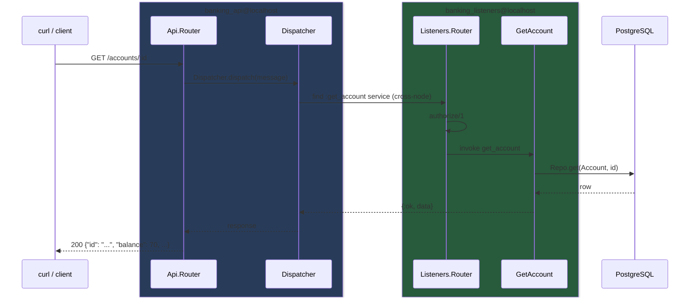

# Banking Example

A reference application demonstrating [x3m_system](../../README.md)'s full CQRS/ES flow.

Poncho project with five independent apps communicating via `X3m.System.Dispatcher`:

| App | Purpose |
|-----|---------|
| `banking` | Shared library (Identity, logger config, mix bless) |
| `banking_event_store` | Extreme TCP wrapper for EventStore |
| `banking_core` | Account aggregate (open, deposit, withdraw, close) |
| `banking_listeners` | Event listener → PG read model + query services |
| `banking_api` | Bandit + Plug HTTP API |

## Architecture

Each app runs as a separate Erlang node. The Dispatcher crosses node boundaries
transparently — the API node doesn't know (or care) which node hosts a given service.

## Command flow (write)

A command enters through HTTP, crosses node boundaries via the Dispatcher,
and reaches the aggregate which emits events persisted to EventStore.

## Query flow (read)

Queries dispatch to listener services on a different node that read from
the PostgreSQL projection — completely separate from the aggregate path.

## Prerequisites

- Elixir >= 1.17
- Docker & Docker Compose

## Setup

Start infrastructure:

    docker compose up -d

Install dependencies and compile each app:

    for app in core listeners api; do
      (cd apps/$app && mix deps.get)
    done

## Running

Start each app in a separate terminal. Order doesn't matter.

**Terminal 1 — Core (aggregates):**

    cd apps/core && ./run.sh

**Terminal 2 — Listeners (read model):**

    cd apps/listeners && ./run.sh

**Terminal 3 — API (HTTP):**

    cd apps/api && ./run.sh

The apps auto-connect via the shared `apps/.iex.exs` (Erlang distribution with `--sname`).

Browse persisted events in the EventStore web UI at
[http://localhost:2113/web/index.html#/streams/$ce-accounts](http://localhost:2113/web/index.html#/streams/$ce-accounts).

## Usage (curl)

Open an account and capture the returned id:

    export ACC=$(curl -s -X POST http://localhost:4001/accounts \
      -H "Content-Type: application/json" \
      -d "{\"owner_id\": \"user-1\", \"invoked_by\": {\"user_id\": \"user-1\"}}" \
      | grep -o '"id":"[^"]*"' | cut -d'"' -f4)

    # → 201  {"id": "<uuid>"}

### Deposit

    curl -sw "\n%{http_code}" -X PUT "http://localhost:4001/accounts/$ACC/deposit" \
      -H "Content-Type: application/json" \
      -d '{"amount": 100, "invoked_by": {"user_id": "user-1"}}'

    # → 204

### Withdraw

    curl -sw "\n%{http_code}" -X PUT "http://localhost:4001/accounts/$ACC/withdraw" \
      -H "Content-Type: application/json" \
      -d '{"amount": 30, "invoked_by": {"user_id": "user-1"}}'

    # → 204

### Get account

    curl -sw "\n%{http_code}" "http://localhost:4001/accounts/$ACC"

    # → 200  {"id": "<uuid>", "owner_id": "user-1", "balance": 70, "status": "open"}

### List accounts (admin only)

    curl -sw "\n%{http_code}" "http://localhost:4001/accounts?admin=true"

    # → 200  [{"id": "<uuid>", "owner_id": "user-1", "balance": 70, "status": "open"}, ...]

### Close account

    curl -sw "\n%{http_code}" -X PUT "http://localhost:4001/accounts/$ACC/close" \
      -H "Content-Type: application/json" \
      -d '{"invoked_by": {"admin?": true}}'

    # → 204
    # If balance was > 0, a Withdrawn event is emitted first, then Closed.

### Error responses

Withdraw more than the balance:

    curl -sw "\n%{http_code}" -X PUT "http://localhost:4001/accounts/$ACC/withdraw" \
      -H "Content-Type: application/json" \
      -d '{"amount": 9999, "invoked_by": {"user_id": "user-1"}}'

    # → 422  {"errors": {"amount": ["insufficient funds"]}}

Wrong user:

    curl -sw "\n%{http_code}" -X PUT "http://localhost:4001/accounts/$ACC/deposit" \
      -H "Content-Type: application/json" \
      -d '{"amount": 10, "invoked_by": {"user_id": "other-user"}}'

    # → 403  {"error": "forbidden"}

Close an already-closed account:

    curl -sw "\n%{http_code}" -X PUT "http://localhost:4001/accounts/$ACC/close" \
      -H "Content-Type: application/json" \
      -d '{"invoked_by": {"user_id": "user-1"}}'

    # → 409  {"error": "account is closed"}

Missing required field:

    curl -sw "\n%{http_code}" -X POST http://localhost:4001/accounts \
      -H "Content-Type: application/json" -d '{}'

    # → 422  {"errors": {"owner_id": ["can't be blank"]}}
