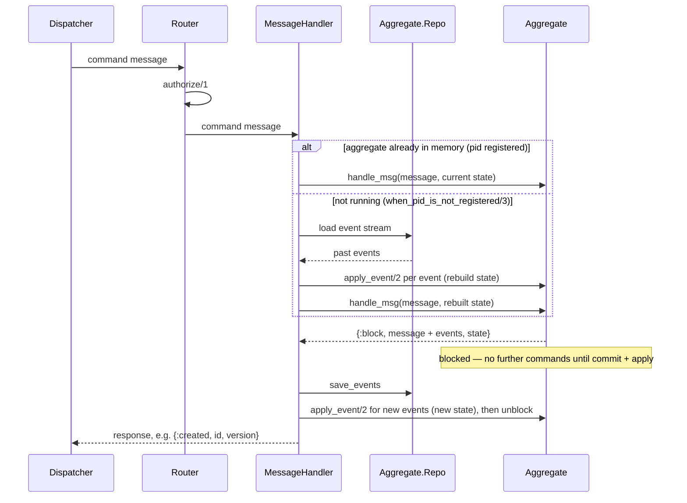

# Aggregates & event sourcing

An **aggregate** is a consistency boundary: a single entity (an account, an order, a
user) that decides whether a command is allowed and what should happen as a result.
In `X3m.System` an aggregate is **event-sourced** by default — its state is not stored
directly but rebuilt by replaying the events it has produced. (You can also persist
state directly instead; see [State persistence](#state-persistence-event-sourcing-or-not).)

This guide builds a small bank-account aggregate. It assumes you're comfortable with
the [messaging layer](messaging.md); aggregates plug into the same routers and
dispatcher.

## The moving parts

| Piece | Responsibility |
|---|---|
| `X3m.System.Aggregate` | decides how a command is handled and how events change state |
| `X3m.System.MessageHandler` | loads the aggregate, runs the command, persists events, replies |
| `X3m.System.Aggregate.Repo` | reads and writes the event stream (you implement it) |
| `X3m.System.Router` | routes a service call to the message handler |

How they collaborate when a command is dispatched — either the aggregate is already in
memory, or it must be rehydrated from its event stream first — then the new events are
persisted:



With `:block`, the aggregate process holds further commands until the message handler has
committed and applied these events — so commands are serialized per aggregate and never run
against not-yet-persisted state. (`:noblock` returns immediately; nothing is persisted.)

## 1. The aggregate

`use X3m.System.Aggregate` and declare the starting state, one command handler per
command, and one `apply_event/2` clause per event:

```elixir
defmodule MyApp.Accounts.Aggregate do
  use X3m.System.Aggregate
  alias X3m.System.Message, as: SysMsg
  alias MyApp.Accounts.{Commands, Events, State}

  @impl X3m.System.Aggregate
  def initial_state, do: %State{}

  handle_msg :open_account, &Commands.Open.new/2, &handle_open/2
  handle_msg :deposit, &Commands.Deposit.new/2, &handle_deposit/2

  defp handle_open(%SysMsg{request: %Commands.Open{} = cmd} = msg, %State{status: :new} = state) do
    event = %Events.Opened{id: cmd.id, owner: cmd.owner}

    msg =
      msg
      |> SysMsg.add_event(event)
      |> SysMsg.created(cmd.id)

    {:block, msg, state}
  end

  defp handle_deposit(%SysMsg{request: %Commands.Deposit{} = cmd} = msg, %State{} = state) do
    event = %Events.Deposited{id: state.id, amount: cmd.amount}

    msg =
      msg
      |> SysMsg.add_event(event)
      |> SysMsg.ok()

    {:block, msg, state}
  end

  def apply_event(%Events.Opened{} = e, %State{} = state),
    do: %State{state | id: e.id, owner: e.owner, status: :open}

  def apply_event(%Events.Deposited{} = e, %State{} = state),
    do: %State{state | balance: state.balance + e.amount}
end
```

### Command handlers and the block/noblock contract

`handle_msg/3` takes a **validate** function and a **process** function:

- The validate function (`Commands.Open.new/2`) casts `message.raw_request` into a
  structured request and stores it with `X3m.System.Message.put_request/2`. If the
  request is invalid, `put_request/2` halts the message with a `:validation_error` and
  the process function never runs.
- The process function returns one of:
  - `{:block, message, state}` — there are events to persist. The message handler saves
    `message.events`, commits, and only then replies.
  - `{:noblock, message, state}` — nothing to persist; the response is returned as-is
    (e.g. an idempotent no-op or a rejected command).

A validate function looks like this (using a plain struct here; an `Ecto.Changeset`
works too, since `put_request/2` checks `valid?`):

```elixir
defmodule MyApp.Accounts.Commands.Open do
  defstruct [:id, :owner, valid?: true]

  alias X3m.System.Message, as: SysMsg

  def new(%SysMsg{raw_request: raw} = msg, _state) do
    cmd = %__MODULE__{
      id: raw["id"],
      owner: raw["owner"],
      valid?: is_binary(raw["id"]) and is_binary(raw["owner"])
    }

    SysMsg.put_request(cmd, msg)
  end
end
```

Use the two-argument `handle_msg/2` when a command needs no separate validation step —
pass a single function that returns the `{:block | :noblock, message, state}` tuple.

### Applying events

`apply_event/2` is the only place state changes. It runs both when a command produces a
new event and when the aggregate is rehydrated from history, so it must be pure. Events
your aggregate doesn't recognise fall through to a default clause that leaves state
unchanged.

### Idempotency

The macros skip a command whose `message.id` was already processed, returning `:ok`
without re-running it. Override `processed_message_id/1` to pull the originating id out
of your event metadata so this survives restarts.

## 2. The message handler

The message handler wires the aggregate to a persistence backend and exposes one
function per command:

```elixir
defmodule MyApp.Accounts.MessageHandler do
  use X3m.System.MessageHandler,
    aggregate_mod: MyApp.Accounts.Aggregate,
    aggregate_repo: MyApp.Accounts.AggregateRepo,
    stream: "accounts",
    pid_facade_mod: X3m.System.AggregatePidFacade,
    event_metadata: %{app_version: "1.0.0"}

  on_new_aggregate :open_account            # id read from raw_request["id"]
  on_aggregate :deposit, id: "account_id"   # id read from raw_request["account_id"]
end
```

Pick the macro that matches the command's intent:

- `on_new_aggregate` — creates a fresh aggregate. The id may be generated if missing.
- `on_aggregate` — loads an existing aggregate; responds `{:error, :not_found}` if there
  is no stream for that id.
- `on_maybe_new_aggregate` — loads the aggregate, creating it if it doesn't exist yet.

Each macro reads the aggregate id from `message.raw_request` (under `"id"` by default,
or the `:id` option), loads or spawns the aggregate process, runs the command, persists
any events, and enriches the response with the new version — `{:ok, version}` or
`{:created, id, version}`.

`:event_metadata` is merged into the metadata stored with every event (handy for
schema/app versions). `:commit_timeout` (per macro) bounds how long persistence may
take.

## 3. The event store (`Aggregate.Repo`)

`X3m.System` does not ship a concrete store — you implement `X3m.System.Aggregate.Repo`
against whatever you use (EventStoreDB, Postgres, an in-memory store for tests):

```elixir
defmodule MyApp.Accounts.AggregateRepo do
  use X3m.System.Aggregate.Repo

  @impl true
  def has?(stream_name), do: # ...

  @impl true
  def stream_events(stream_name, start_at, per_page), do: # ... enumerable of {event, number, metadata}

  @impl true
  def delete_stream(stream_name, hard_delete?, expected_version), do: :ok

  @impl true
  def save_events(stream_name, message, events_metadata), do: {:ok, _last_event_number}
end
```

Stream names are built from the handler's `:stream` option and the aggregate id, e.g.
`"accounts-acc-1"`.

## 4. Wiring it into your app

Register the router's services, and start the per-node aggregate processes by adding
`X3m.System.LocalAggregatesSupervision` to your supervision tree. First, list the
aggregate modules to run locally:

```elixir
defmodule MyApp.LocalAggregates do
  use X3m.System.LocalAggregates, [MyApp.Accounts.Aggregate]
end
```

Then in your application:

```elixir
def start(_type, _args) do
  :ok = MyApp.Router.register_services()

  children = [
    MyApp.Accounts.AggregateRepo,
    {X3m.System.LocalAggregatesSupervision, [MyApp.LocalAggregates, MyApp]}
  ]

  Supervisor.start_link(children, strategy: :one_for_one, name: MyApp.Supervisor)
end
```

Now a dispatch flows end to end:

```elixir
:open_account
|> X3m.System.Message.new(raw_request: %{"id" => "acc-1", "owner" => "Ada"})
|> X3m.System.Dispatcher.dispatch()
#=> %X3m.System.Message{response: {:created, "acc-1", 0}, ...}
```

## Testing the aggregate

Because an aggregate is just a module — no process, no event store, no dispatch — you
test it by calling its command functions directly and replaying the events they return.
`X3m.System.Aggregate.TestSupport` gives you the given/when/then pieces:
`command_message/3` builds the command message, `state_from_events/3` rebuilds the
*given* state from prior events, and `apply_events/4` folds the events a command *emitted*
back onto that state so you can assert the result:

```elixir
defmodule MyApp.Accounts.AggregateTest do
  use ExUnit.Case, async: true

  import X3m.System.Aggregate.TestSupport
  alias MyApp.Accounts.{Aggregate, Events, State}
  alias X3m.System.Message, as: SysMsg

  test "open_account emits Opened and responds :created" do
    # given
    state = X3m.System.Aggregate.initial_state(Aggregate)
    # when
    msg = command_message(:open_account, %{"id" => "acc-1", "owner" => "Ada"})

    assert {:block, %SysMsg{events: events, response: {:created, "acc-1"}}, _state} =
             Aggregate.open_account(msg, state)

    assert [%Events.Opened{id: "acc-1", owner: "Ada"}] = events

    # then — replay the emitted events to assert the resulting state
    assert %{client_state: %State{status: :open, owner: "Ada"}} =
             apply_events(Aggregate, state, events)
  end

  test "open_account with a missing owner is a validation error" do
    state = X3m.System.Aggregate.initial_state(Aggregate)
    msg = command_message(:open_account, %{"id" => "acc-1"})

    assert {:noblock,
            %SysMsg{events: [], response: {:validation_error, _request}, halted?: true},
            ^state} = Aggregate.open_account(msg, state)
  end

  test "deposit adds to the balance of an open account" do
    # given an already-opened account
    state = state_from_events(Aggregate, [%Events.Opened{id: "acc-1", owner: "Ada"}])

    # when
    deposit = command_message(:deposit, %{"account_id" => "acc-1", "amount" => 100})

    assert {:block, %SysMsg{events: events, response: :ok}, _state} =
             Aggregate.deposit(deposit, state)

    # then
    assert [%Events.Deposited{amount: 100}] = events
    assert %{client_state: %State{balance: 100}} = apply_events(Aggregate, state, events)
  end
end
```

A few things to note:

- The functions you call (`open_account/2`, `deposit/2`) are the ones `handle_msg`
  generates — named after the message and taking `(message, state)`.
- `command_message/3` builds the message (with `raw_request` and `assigns`),
  `state_from_events/3` is the *given* state, and `apply_events/4` is the *then* step.
- A command's validate function receives `(message, state)`, so it can validate against
  state — e.g. rejecting a deposit into a closed account with a `validation_error`.
- A command may emit events *and* return an error (`{:block, error, state}`) — e.g.
  recording a rejection while replying `{:error, _}` — and a single command may emit
  several events (closing an account can return the remaining balance and then close it).
  So assert the emitted events, not just the response.
- A failed validation comes back as `{:noblock, message, state}` with `message.events ==
  []`, `halted?: true` and a `{:validation_error, request}` response (authorization
  guards look the same with an `{:error, _}` response) — no setup required to assert.
- Calling a successful handler returns the events but does **not** apply them; state
  changes happen in `apply_event/2` at commit time. Replaying the returned events with
  `apply_events(events, version, state)` both gives you the resulting state to assert on
  and exercises your `apply_event/2` clauses.
- No message handler, repo, or running process is involved, so these are plain, fast,
  `async: true` unit tests.

## Testing the full lifecycle

The tests above cover your command logic. To exercise the *runtime* — loading and spawning
the aggregate process, persisting events, idempotency, and your handler's **overrides**
(`save_events/1`, `save_state/3`, `when_pid_is_not_registered/3`, `:unload_aggregate_on`) —
you need a running aggregate and a repo. In tests, back it with an **in-memory
`Aggregate.Repo`** instead of a real event store:

```elixir
defmodule MyApp.Accounts.InMemoryEventStore do
  @moduledoc false
  use X3m.System.Aggregate.Repo
  use Agent

  alias X3m.System.Message

  def start_link(_opts \\ []),
    do: Agent.start_link(fn -> %{} end, name: __MODULE__)

  def reset(),
    do: Agent.update(__MODULE__, fn _state -> %{} end)

  @impl true
  def has?(stream_name),
    do: Agent.get(__MODULE__, &Map.has_key?(&1, stream_name))

  @impl true
  def stream_events(stream_name, _start_at \\ 0, _per_page \\ 1_000),
    do: Agent.get(__MODULE__, &Map.get(&1, stream_name, []))

  @impl true
  def delete_stream(stream_name, _hard_delete?, _expected_version) do
    Agent.update(__MODULE__, &Map.delete(&1, stream_name))
    :ok
  end

  @impl true
  def save_events(stream_name, %Message{} = message, metadata) do
    __MODULE__
    |> Agent.get_and_update(fn streams ->
      existing = Map.get(streams, stream_name, [])
      current = length(existing) - 1

      # optimistic concurrency: the expected version is the aggregate's loaded version
      # (-1 for a new aggregate), so a "create" against an existing stream is rejected.
      if message.aggregate_meta.version != current do
        {{:error, :wrong_expected_version, current}, streams}
      else
        # stamp message.id into metadata so idempotency survives a rehydrate
        meta = Map.put(metadata, :message_id, message.id)

        appended =
          message.events
          |> Enum.with_index(current + 1)
          |> Enum.map(fn {event, number} -> {event, number, meta} end)

        last = current + length(message.events)
        {{:ok, last}, Map.put(streams, stream_name, existing ++ appended)}
      end
    end)
  end
end
```

Start it alongside the aggregate's supervision tree in `test/test_helper.exs`:

```elixir
{:ok, _} = MyApp.Accounts.InMemoryEventStore.start_link()

{:ok, _} =
  X3m.System.LocalAggregatesSupervision.start_link([MyApp.LocalAggregates, MyApp])
```

Point a test message handler at the in-memory store, then drive it by calling the generated
functions directly and asserting on both the reply and the stored events:

```elixir
defmodule MyApp.Accounts.MessageHandlerTest do
  # the pid facade and registry are named per aggregate module
  use ExUnit.Case, async: false

  import X3m.System.Aggregate.TestSupport
  alias MyApp.Accounts.{MessageHandler, InMemoryEventStore, Events}

  setup do
    InMemoryEventStore.reset()
    :ok
  end

  test "opens an account and persists the event" do
    id = UUID.uuid4()
    msg = command_message(:open_account, %{"id" => id, "owner" => "Ada"})

    assert {:reply, replied} = MessageHandler.open_account(msg)
    assert {:created, ^id, 0} == replied.response
    assert [{%Events.Opened{}, 0, _}] = InMemoryEventStore.stream_events("accounts-" <> id)
  end
end
```

Notes:

- Use a fresh aggregate id per test; reuse an id only when you are deliberately testing
  rehydration or idempotency (unload the process — `AggregatePidFacade.exit_process/3` — to
  force the next command to reload).
- `save_events/3` stamps `message.id` into each event's metadata so idempotency survives a
  rehydrate (the aggregate re-reads it via `processed_message_id/1` while replaying).
- This is how you test *your* overrides — `save_events/1` reacting to or filtering events,
  `:unload_aggregate_on` rules, the save/load callbacks below — rather than the library
  internals. For a non-event-sourced handler, point `save_state/3` and
  `when_pid_is_not_registered/3` at a plain in-memory store the same way.

## Validating without persisting (`dry_run`)

`X3m.System.Dispatcher.validate/1` dispatches the command with `dry_run: true`: the
aggregate runs the command exactly as it would normally, but the message handler does
**not** persist any events and the aggregate's `rollback/2` callback is invoked so it
can undo any side effects. The response tells you whether the command *would* have
succeeded. If a command performs side effects during handling (e.g. reserving a unique
value), implement the `commit/2` and `rollback/2` callbacks on the aggregate.

## State persistence: event sourcing or not

Event sourcing is the default, but how an aggregate's state is saved and restored is
governed by two overridable message-handler callbacks:

- `save_state/3` — called after each successful commit. Override it to persist the
  aggregate's state.
- `when_pid_is_not_registered/3` — called when a command targets an aggregate whose
  process isn't currently running. Override it to decide how that process is hydrated.

Together they support a spectrum:

- **Pure event sourcing (default):** `when_pid_is_not_registered/3` replays the event
  stream through `apply_event/2`; `save_state/3` does nothing.
- **Snapshots on top of events:** `save_state/3` stores a periodic snapshot;
  `when_pid_is_not_registered/3` loads the latest snapshot and replays only the events
  after it.
- **Non-event-sourced (state-based) aggregates:** `save_state/3` persists the full current
  state (it receives the wrapped `%X3m.System.Aggregate.State{}`, so you can store its
  `client_state` and `version`); `when_pid_is_not_registered/3` loads that row, spawns the
  process and seeds it with `X3m.System.GenAggregate.set_state(pid, loaded_state, version)` —
  no event replay at all. `set_state/3` rebuilds the process's `client_state` through your
  aggregate's `set_state/1` callback (the state-based analogue of `initial_state/0` — "for
  this loaded data, give me back your state"; defaults to the identity) and restores the
  version.

Your command logic (`handle_msg`) is identical in all three cases; only how state is
saved and restored differs.

To unload idle aggregates and reclaim memory, pass `:unload_aggregate_on` to
`use X3m.System.MessageHandler` with rules keyed on emitted events or current state.

When several nodes can host the same aggregate, see [Distribution](distribution.md) for
how a request is routed to the node where the aggregate already lives.
