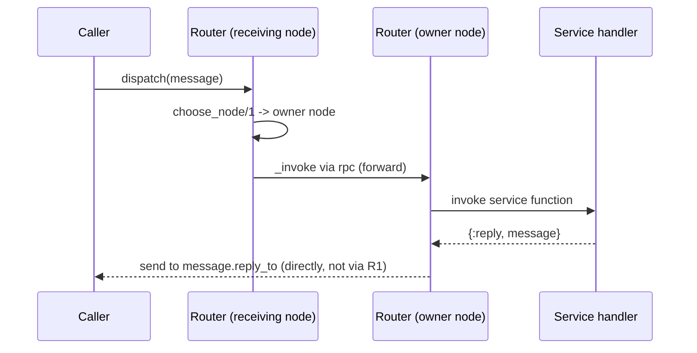

# Distribution

`X3m.System` is built for clusters. The same `X3m.System.Dispatcher.dispatch/2` call
works whether the service runs on the local node or a remote one — discovery and the
remote call are handled for you. This guide covers how nodes find each other's
services, how a provider is chosen, and how to forward work to a specific node.

## How discovery works

When a router calls `register_services/0`, its **public** services are announced to the
other connected nodes, and nodes exchange their service maps as they join and leave the
cluster. The dispatcher asks this registry which nodes offer `message.service_name`:

- a **local** provider is invoked directly in a supervised task;
- a **remote** provider is invoked over `:rpc`, and the provider sends the reply
  straight back to the caller's process.

If no node offers the service, the response is `{:service_unavailable, service_name}`.

## Public vs private services

In a router, choose how widely a service is advertised:

```elixir
defmodule MyApp.Router do
  use X3m.System.Router

  service :open_account, MyApp.Accounts.MessageHandler    # public: announced cluster-wide
  servicep :rebuild_projection, MyApp.Projections          # private: local node only

  def authorize(_), do: :ok
end
```

Public services (`service`) participate in cluster discovery, so any node can dispatch
to them. Private services (`servicep`) are only callable on the node that registered
them and are never advertised to peers — useful for node-local maintenance work.

## Choosing the node: forwarding to where the aggregate lives

When several nodes can host the same aggregate, you usually want a command to run on the
node where that aggregate is already in memory, rather than spinning it up elsewhere.
The router's `choose_node/1` callback decides this. It defaults to `:local`; override it
to return the `node()` that should handle the message:

```elixir
defmodule MyApp.Router do
  use X3m.System.Router

  service :deposit, MyApp.Accounts.MessageHandler

  def authorize(_), do: :ok

  # Look the aggregate up in a distributed registry (e.g. Horde) and run the command
  # on the node that currently owns it.
  def choose_node(%X3m.System.Message{raw_request: %{"account_id" => id}}) do
    case Horde.Registry.lookup(MyApp.AggregateRegistry, id) do
      [{_pid, node}] -> node
      _ -> :local
    end
  end

  def choose_node(_message), do: :local
end
```

When `choose_node/1` returns a remote node, the router forwards the call there; that
node runs the handler and replies **directly** to the original caller — the response
does not hop back through the node that received the request.



## Asking for another node

Sometimes a node accepts a call but then realises it can't serve it (for example, a
quorum isn't met). It can tell the dispatcher to try a different provider by responding
with `{:error, {:try_another_node, reason}}`:

```elixir
def deposit(%X3m.System.Message{} = msg) do
  if quorum_met?() do
    {:reply, handle(msg)}
  else
    {:reply, X3m.System.Message.error(msg, {:try_another_node, :quorum_not_met})}
  end
end
```

The dispatcher then tries the next node offering the service. If every provider asks to
try another node, the response becomes `{:error, {:no_nodes_available, nodes}}`, where
`nodes` lists each node and the reason it gave.

## Logging across nodes

By default a router ensures that log output produced while handling a *remote* call
stays on the node doing the work, rather than leaking into the caller's stdout. When
driving services from an `iex` session it can be handy to see that output locally —
pass `ensure_local_logging?: false`:

```elixir
defmodule MyApp.Router do
  use X3m.System.Router, ensure_local_logging?: false
  # ...
end
```

## Calling one service from another

Services frequently call other services. Build the child message with
`X3m.System.Message.new_caused_by/3` so correlation and causation ids are preserved
across the hop, then dispatch as usual:

```elixir
:get_owner_details
|> X3m.System.Message.new_caused_by(msg, raw_request: %{"owner_id" => owner_id})
|> X3m.System.Dispatcher.dispatch()
```

This works the same whether the target service is local or on another node.
