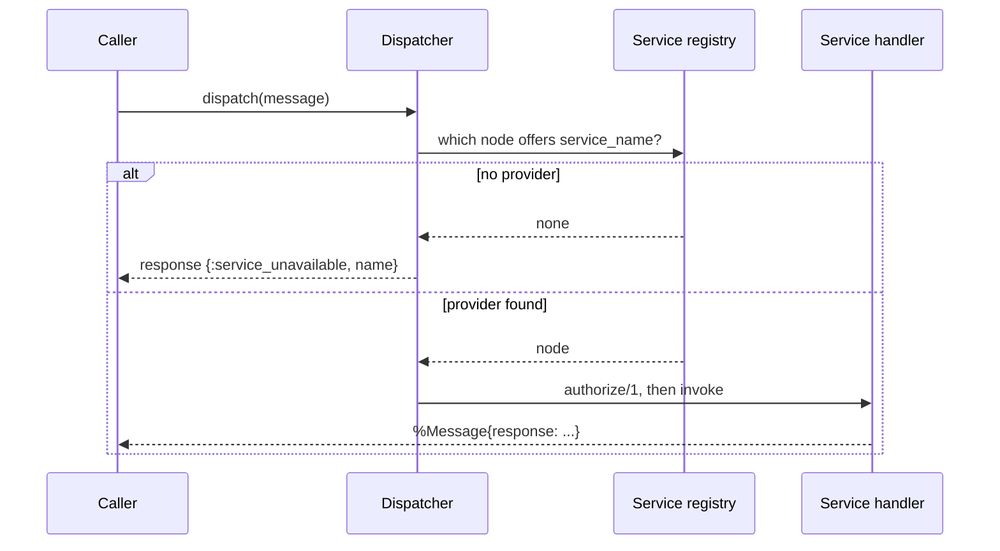

# Messaging

The messaging layer — `X3m.System.Message`, `X3m.System.Router` and
`X3m.System.Dispatcher` — is the foundation everything else builds on. It works on its
own: you do not need aggregates or an event store to use it.

## The message

`X3m.System.Message` is the envelope that travels from the caller to a service and
back. You create one with `X3m.System.Message.new/2`:

```elixir
alias X3m.System.Message, as: SysMsg

msg = SysMsg.new(:open_account, raw_request: %{"id" => "acc-1", "owner" => "Ada"})
```

Useful fields:

- `service_name` — which service should handle it (`:open_account` above).
- `raw_request` — the request as received (e.g. controller `params`).
- `request` — a validated/structured request, set with `put_request/2` once you've
  cast `raw_request` into a changeset or struct.
- `assigns` — a map for values you want to carry alongside the request; set with
  `assign/3` (e.g. the authenticated user).
- `response` — set by the handler, read by the caller.
- `correlation_id` / `causation_id` — ids that tie a conversation together (see below).

```elixir
msg = SysMsg.assign(msg, :invoked_by, current_user)
```

### Correlating and causing messages

Every message has a `correlation_id` (the id of the message that *started* the
conversation) and a `causation_id` (the id of the message that *directly caused* this
one). When one service needs to call another, build the child message with
`new_caused_by/3` so the chain is preserved:

```elixir
:get_owner_details
|> SysMsg.new_caused_by(msg, raw_request: %{"owner_id" => owner_id})
|> X3m.System.Dispatcher.dispatch()
```

## The router

A router registers services and decides who is allowed to call them.

```elixir
defmodule MyApp.Router do
  use X3m.System.Router

  service :open_account, MyApp.Accounts
  service :get_account, MyApp.Accounts, :read        # different function name
  servicep :rebuild_projection, MyApp.Accounts        # private to this node

  def authorize(%X3m.System.Message{service_name: :open_account, assigns: %{invoked_by: %{admin?: true}}}),
    do: :ok

  def authorize(_message), do: :forbidden
end
```

- `service/2` and `service/3` register a **public** service — one that is announced to
  other nodes in the cluster.
- `servicep/2` and `servicep/3` register a **private** service — usable on the local
  node but never advertised to peers.
- `authorize/1` runs before the handler. Return `:ok` to proceed; any other value
  becomes the response sent back to the caller. If you don't define a catch-all clause,
  the router denies by default.

Announce the services at runtime (typically from `start/2`):

```elixir
:ok = MyApp.Router.register_services()
```

You can introspect what a router registered with `registered_services/1`
(`:public`, `:private`, or `:all`).

## Handlers

A handler is just a function that takes a `X3m.System.Message` and returns either:

- `{:reply, message}` — send `message` back to the caller, or
- `:noreply` — send nothing.

```elixir
defmodule MyApp.Accounts do
  alias X3m.System.Message

  def read(%Message{} = message) do
    account = lookup(message.raw_request["id"])
    {:reply, Message.ok(message, account)}
  end
end
```

`X3m.System.Message` provides helpers that set the response and mark the message done:
`ok/1`, `ok/2`, `created/2`, `error/2`, and the lower-level `return/2`.

## Dispatching

`X3m.System.Dispatcher.dispatch/2` discovers a node offering the service, invokes it,
and waits for the reply:

```elixir
:open_account
|> SysMsg.new(raw_request: %{"id" => "acc-1"})
|> X3m.System.Dispatcher.dispatch(timeout: 10_000)
```



- The default timeout is 5000 ms; on expiry the response becomes
  `{:service_timeout, service_name, message_id, timeout}`.
- If no node offers the service, the response is
  `{:service_unavailable, service_name}`.

To check a command without committing its effects, use `validate/1` — it dispatches
with `dry_run: true`, so aggregate-backed services run the command and report whether
it *would* succeed without persisting events. See
[Aggregates & event sourcing](aggregates-and-event-sourcing.md) for `dry_run` details.

## Responses

By the time `dispatch/2` returns, `message.response` holds one of the shapes described
by `X3m.System.Response`. Callers pattern-match on it:

```elixir
case X3m.System.Dispatcher.dispatch(msg) do
  %SysMsg{response: {:ok, account}} -> ...
  %SysMsg{response: {:created, id, _version}} -> ...
  %SysMsg{response: {:validation_error, changeset}} -> ...
  %SysMsg{response: {:error, reason}} -> ...
end
```

To run services across more than one node, continue with [Distribution](distribution.md).
